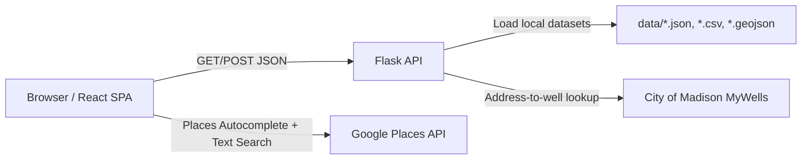

# TapMap

Hyperlocal water-quality risk intelligence for Madison, WI.

TapMap is a full-stack web app that lets a user enter an address, map that address to serving wells, and inspect a transparent risk snapshot built from PFAS, nitrate, chromium-6, radionuclides, sodium/chloride, VOCs, and violation history.

## What the app does

- Shows Madison well service zones on an interactive map.
- Supports address autocomplete and geocoding through Google Places APIs.
- Maps an address to City of Madison serving wells (`/api/address-wells`).
- Computes weighted address score snapshots using well mix percentages.
- Displays score, grade, worst contaminant, and category-level comparisons.
- Provides light/dark themes plus dedicated `Metrics` and `Scoring` explainer pages.

## Live app routes

- `/` (main map experience)
- `/phase-3` (alias of main map page)
- `/metrics` (metric glossary and interpretation guide)
- `/scoring` (scoring pipeline and grade-band explanation)

## Screenshots


## Architecture



### Frontend

- React + TypeScript + Vite
- TailwindCSS for styling
- Leaflet/React-Leaflet for mapping
- Recharts for radar visualization

### Backend

- Flask + Flask-CORS
- Scoring engine in `backend/app/scoring_engine.py`
- City address-to-well mapper in `backend/app/city_mapping.py`
- Data loader and reference limits in `backend/app/well_data.py`

## Repository layout

```text
frontend/   React app (map UI, scoring panels, metrics/scoring pages)
backend/    Flask API, scoring engine, city mapping integration, tests
data/       Canonical local datasets (wells, PFAS, inorganics, service areas)
docs/       Setup and phase checklists
reports/    Phase reports and evidence artifacts
scripts/    Developer helper scripts
```

## Local development setup

### 1) Prerequisites

- Node.js 18+
- npm 9+
- Python 3.11+

### 2) Configure environment variables

Frontend:

```bash
cd frontend
cp .env.example .env
```

Set values in `frontend/.env`:

```bash
VITE_GOOGLE_MAPS_API_KEY=YOUR_BROWSER_KEY
VITE_API_BASE_URL=http://localhost:5000
```

Backend (optional):

```bash
cd backend
cp .env.example .env
```

Defaults:

```bash
FLASK_ENV=development
PORT=5000
```

### 3) Run backend

```bash
cd backend
python3 -m venv .venv
source .venv/bin/activate
pip install -r requirements.txt
python run.py
```

Health check:

```bash
curl http://localhost:5000/health
```

### 4) Run frontend

```bash
cd frontend
npm install
npm run dev
```

Open `http://localhost:5173`.

### Optional helper scripts

From repo root:

```bash
./scripts/dev-backend.sh
./scripts/dev-frontend.sh
```

## API reference

### `GET /health`

Simple health probe.

Response:

```json
{ "ok": true }
```

### `GET /api/wells`

Returns scored well summaries used for map overlays/popups and baseline UI state.

### `POST /api/score`

Two supported request modes:

1) Score by coordinates:

```json
{ "lat": 43.0731, "lng": -89.4012 }
```

2) Score a weighted well mix:

```json
{
  "wellIds": ["6", "30"],
  "wellWeights": { "6": 70, "30": 30 },
  "zoneId": "city-map:6-30"
}
```

Core response fields:

- `score`, `grade`
- `wellIds`, `zoneId`, `outOfZone`
- `availableCategories`, `categoryScores`
- `contaminants`
- `worstContaminant`
- `comparisons`

### `POST /api/address-wells`

Maps an address to city well distribution using the City of Madison MyWells endpoint.

Request:

```json
{ "address": "835 W Dayton St, Madison, WI" }
```

### `POST /api/submit`

Community submission stub endpoint (contract-level only in current build).

## Scoring model (summary)

Overall score is based on weighted category risks (0 to 1), converted to a safety score:

```text
score = (1 - weighted_risk) * 100
```

Current category weights:

- PFAS: `0.25`
- Nitrate: `0.20`
- Chromium-6: `0.15`
- Radionuclides: `0.15`
- Sodium/Chloride: `0.10`
- Violations: `0.10`
- VOCs: `0.05`

Grade bands:

- `90-100`: A
- `80-89`: B
- `70-79`: C
- `60-69`: D
- `0-59`: F

Address scores use weighted blending when well usage ranges are available from city mapping.

## Data inputs

Primary local data files:

- `data/well_coordinates.csv`
- `data/well_service_areas.geojson`
- `data/pfas_well_latest.json`
- `data/well_inorganics_2024.json`
- `data/madison_violations.csv`

Backend prefers `backend/data/` in packaged/runtime environments and falls back to repo-root `data/` in local dev.

## Testing

Run backend test suite:

```bash
cd backend
source .venv/bin/activate
pytest -q tests
```

Run frontend production build check:

```bash
cd frontend
npm run build
```

## Deployment notes

### Backend (Cloud Run, source deploy)

If no Dockerfile is present, deploy from source:

```bash
gcloud run deploy tapmap-backend \
  --source backend \
  --region us-central1 \
  --allow-unauthenticated \
  --set-env-vars FLASK_ENV=production
```

Set frontend API base URL to deployed backend URL:

```bash
VITE_API_BASE_URL=https://YOUR-CLOUD-RUN-URL
```

### Frontend (static hosting)

Build output:

```bash
cd frontend
npm run build
```

Upload `frontend/dist/` contents to your static host (or configure CI deploy).

## Google Maps API key security

The frontend key is intentionally client-side and must be restricted in Google Cloud:

- Application restriction: HTTP referrers
- Referrers:
  - `https://tap-map.org/*`
  - `http://tap-map.org/*`
  - `http://localhost:*/*`
  - `http://127.0.0.1:*/*`
- API restrictions (minimum):
  - Places API (New)

If you later add direct browser calls to other Google Maps services, explicitly add only those APIs.

Do not leave this key unrestricted.

## Troubleshooting

- `vite: command not found`
  - Run `npm install` inside `frontend/` before `npm run dev`.
- `Address already in use` for backend
  - Use another port: `PORT=5001 python run.py` and set `VITE_API_BASE_URL=http://localhost:5001`.
- API error: `Address must start with a house number`
  - Use a full street address beginning with house number (example: `610 N Whitney Way, Madison, WI`).
- Empty autocomplete
  - Verify `VITE_GOOGLE_MAPS_API_KEY` and API restrictions/referrer config.
- Frontend cannot reach backend
  - Confirm backend is running and `VITE_API_BASE_URL` matches backend host/port.

## License

Hackathon project repository. Add your preferred license before broader distribution.
